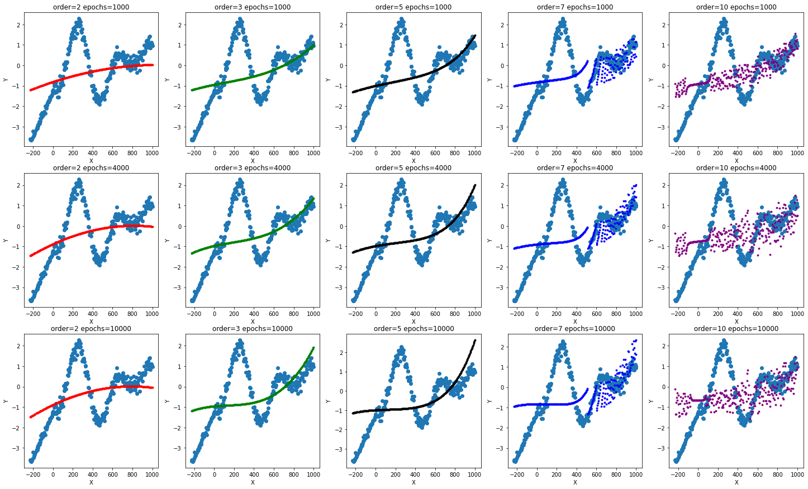

# Univariate Regression with Gradient Descent
----------------------------------------------------
In this Python script, univariate (linear and polynomial) Regression is implemented using Gradient Descent algorithm.
The performance of the algorithm is evaluated on a simple one-dimensional dataset

Results:
----------------------------------------------------
The following diagram shows the results on different values of order and epochs.

